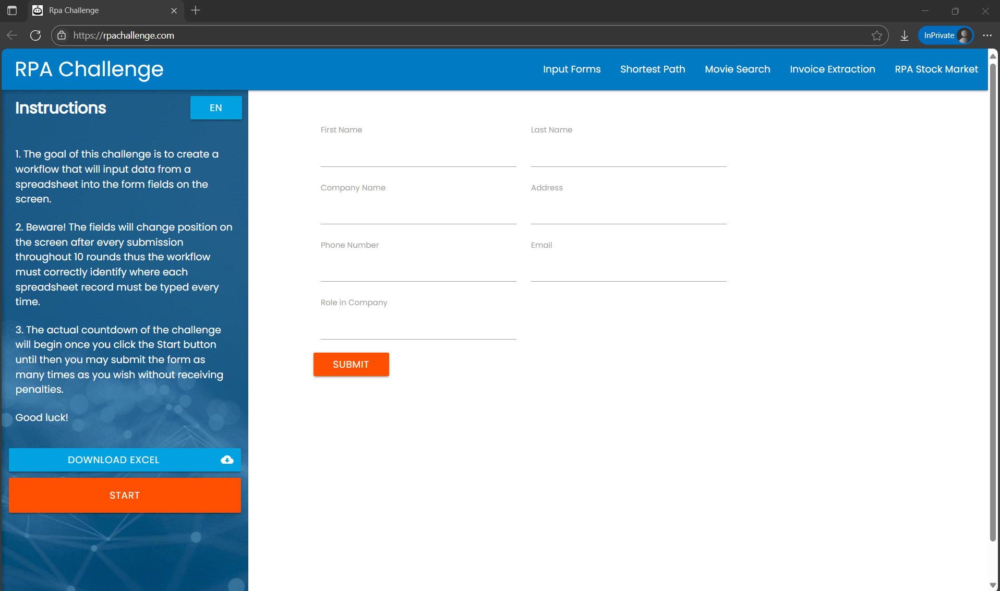

# 🤖 RPAChallenge1 - UiPath Project

This is a UiPath automation project that completes the [RPA Challenge](https://rpachallenge.com/) by:

✅ Reading data from an Excel file  
✅ Opening the RPA Challenge form  
✅ Typing data row by row dynamically (fields change order)  
✅ Submitting each entry after filling all fields  
✅ Looping until all Excel rows are submitted  

---

## 📂 Project Structure

- `Main.xaml` — Main automation logic
- `RPAChallenge1.xlsx` — Input data file
- `project.json` — UiPath project metadata

---

## 🧰 Prerequisites

- UiPath Studio installed
- Excel installed
- Chrome/Edge with UiPath extension enabled

---

## 📌 How It Works

1. Opens the Excel file `RPAChallenge1.xlsx`
2. Reads each row into a DataTable
3. Navigates to `https://rpachallenge.com/`
4. Clicks "Start"
5. Enters the data row into dynamically ordered form fields using `Anchor Base`
6. Clicks "Submit"
7. Loops until all rows are submitted

---

## 📸 Screenshots

  
---

## ▶️ How to Run

1. Clone this repository
2. Open `RPAChallenge1` folder in UiPath Studio
3. Open `Main.xaml`
4. Make sure Excel file is in the same folder
5. Run the process

---

## 🛠️ Built With

- [UiPath Studio](https://www.uipath.com/)
- Excel Application Scope
- DataTable Looping
- Anchor Base Activities
- Chrome Browser Automation

---

## 🙋‍♀️ Author

**Srushti Arekar**  
[GitHub Profile](https://github.com/SrushtiArekar)

---

## 📄 License

This project is licensed under the MIT License - see the [LICENSE](LICENSE) file for details.
