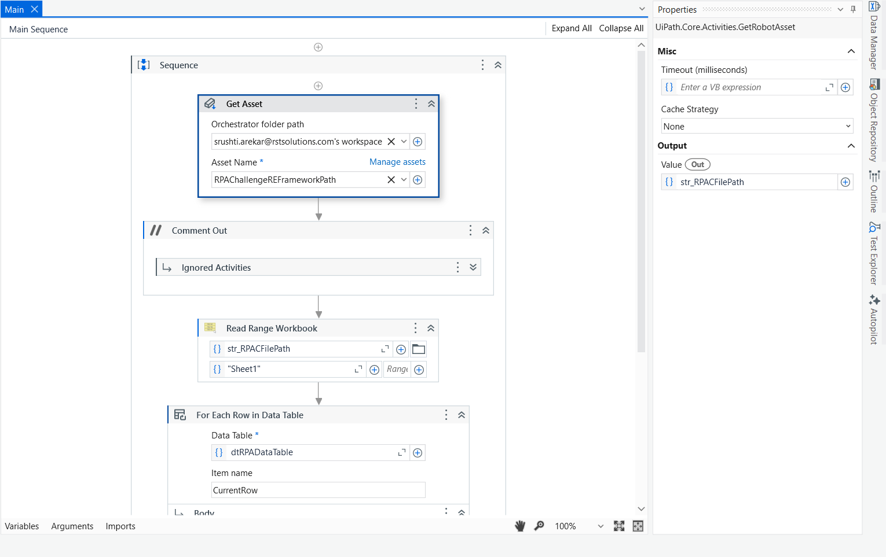
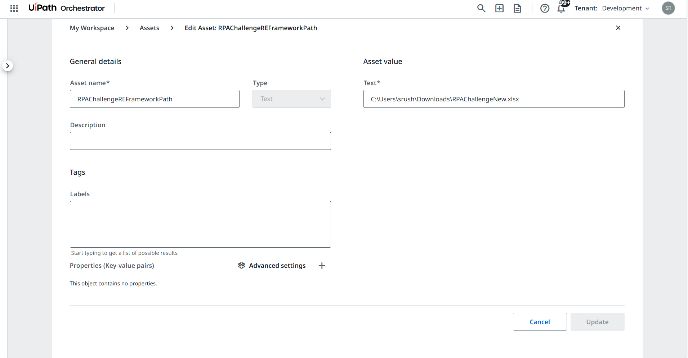
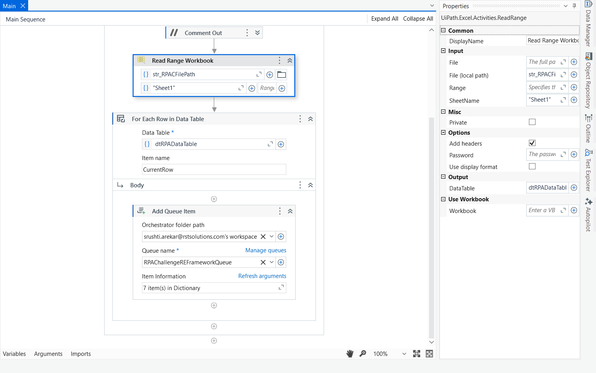
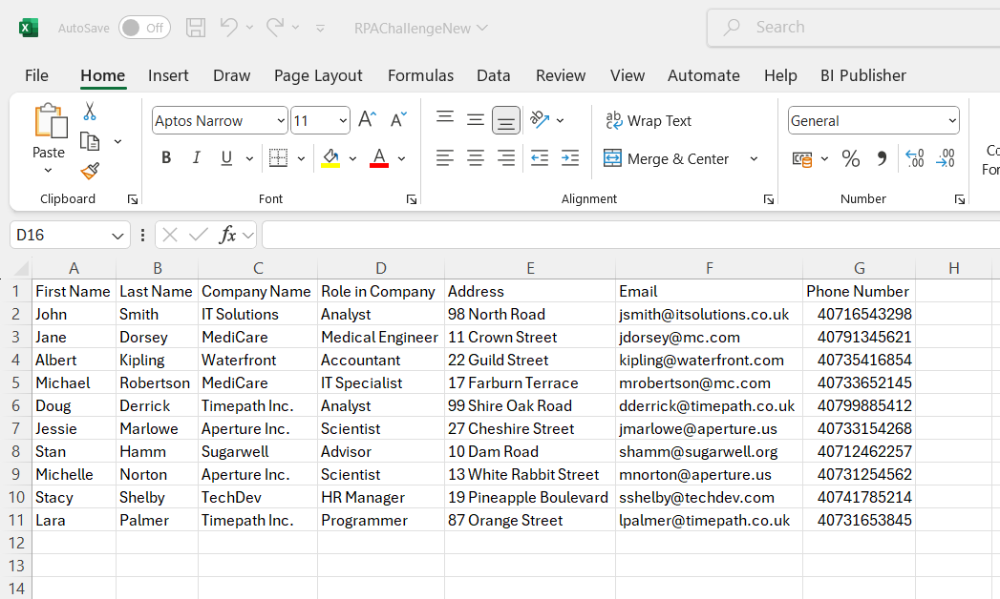
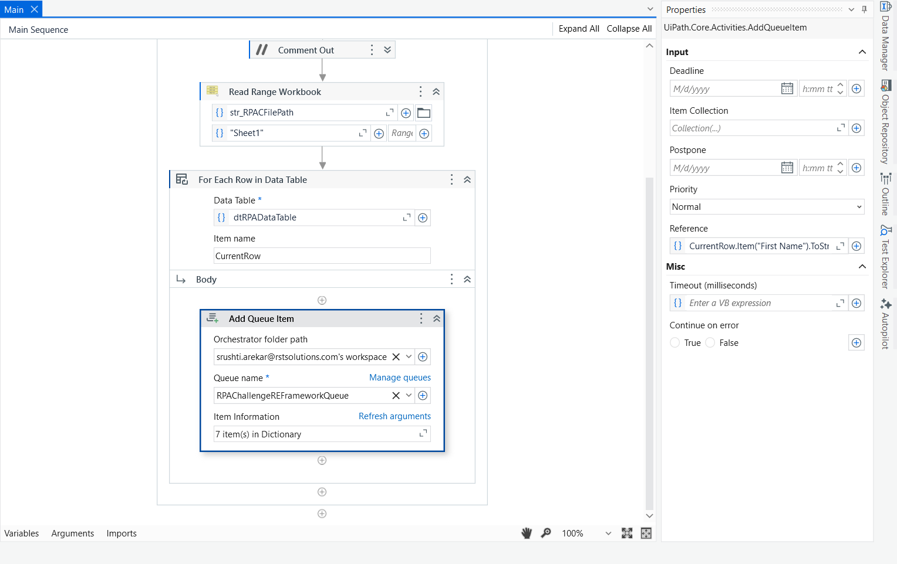
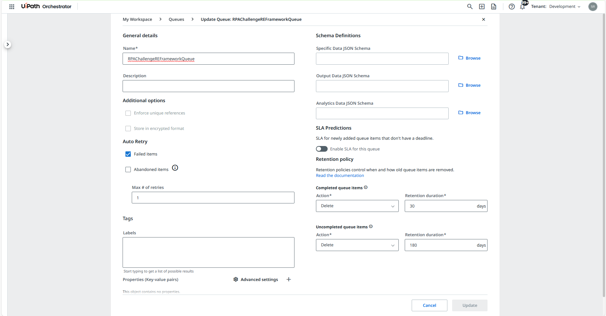
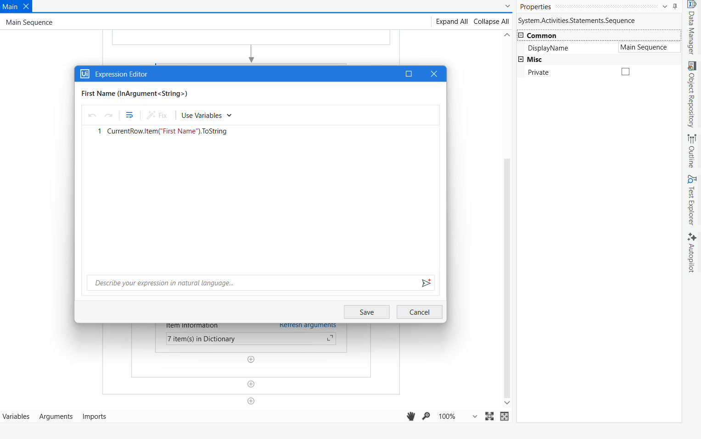

# 📦 RPAChallengeREFrameworkDispatcher – Dispatcher Project

This is the **Dispatcher** part of the REFramework-based solution for the [RPA Challenge](https://rpachallenge.com/). It reads structured input data from an Excel file and pushes each row as a separate **Queue Item** into **UiPath Orchestrator** for processing by the Performer bot.

---

## 🎯 Purpose

This Dispatcher handles the data preparation and transaction item creation by:

- Fetching the input Excel file path from an **Orchestrator Asset**
- Reading all rows from the Excel sheet into a `DataTable`
- Looping through each row and mapping values to key-value pairs
- Adding each row as a **Queue Item** into `RPAChallengeREFrameworkQueue` using `Add Queue Item`

---

## 🔄 Workflow Overview

1. **Get Asset**  
   - Reads the asset `Input_FilePath` from Orchestrator, which holds the full path of the input Excel file.

2. **Read Excel File**  
   - Uses **Read Range** to load the data from Excel into a `DataTable` named `dtRPADataTable`.

3. **Loop Through Each Row**  
   - Iterates over each row in the `dtRPADataTable` using:
     ```vb
     For Each CurrentRow In dtRPADataTable.Rows
     ```
   - For each row, directly maps field values inside the `Add Queue Item` activity using:
     ```vb
     SpecificContent → Collection:
     {
         {"FirstName", CurrentRow.Item("First Name").ToString},
         {"LastName", CurrentRow.Item("Last Name").ToString},
         {"CompanyName", CurrentRow.Item("Company Name").ToString},
         {"RoleInCompany", CurrentRow.Item("Role in Company").ToString},
         {"Address", CurrentRow.Item("Address").ToString},
         {"Email", CurrentRow.Item("Email").ToString},
         {"PhoneNumber", CurrentRow.Item("Phone Number").ToString}
     }
     ```
   - **No separate dictionary variables are created.** The key-value pairs are configured **inline** within the `Add Queue Item` activity’s `SpecificContent` property.
   - Each iteration results in **one queue item** added to `RPAChallengeREFrameworkQueue`.

---

## 🧠 Queue Configuration

- **Queue Name:** `RPAChallengeREFrameworkQueue`
- **Queue Type:** Classic Queue in Orchestrator
- **Transaction Item Content Example:**
  ```json
  {
    "FirstName": "John",
    "LastName": "Doe",
    "CompanyName": "Acme Corp",
    "RoleInCompany": "Engineer",
    "Address": "123 Main Street",
    "Email": "john.doe@example.com",
    "PhoneNumber": "1234567890"
  }

## 📸 Screenshots

1. Get the Asset



2. Read Range Workbook



3. Add Queue Item



4. Mapping in Add Queue Activity



5. After Execution - successfully added the data from the Excel to Queue
When we View the Transactions in Queue

