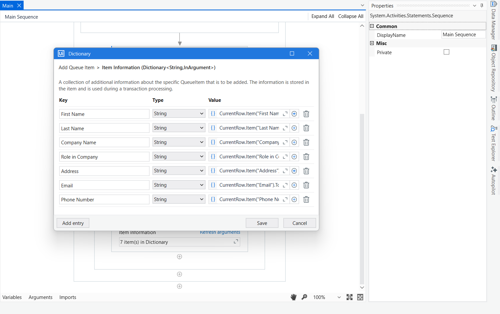

# 📦 RPAChallengeREFrameworkDispatcher – Dispatcher Project

This is the **Dispatcher** part of the REFramework-based solution for the [RPA Challenge](https://rpachallenge.com/). It reads structured input data from an Excel file and pushes each row as a separate **Queue Item** into **UiPath Orchestrator** for processing by the Performer bot.

---

## 🎯 Purpose

This Dispatcher handles the data preparation and transaction item creation by:

- Fetching the input Excel file path from an **Orchestrator Asset**
- Reading all rows from the Excel sheet into a `DataTable`
- Looping through each row and mapping values to key-value pairs
- Adding each row as a **Queue Item** into `RPAChallengeREFrameworkQueue` using `Add Queue Item`

---

## 🔄 Workflow Overview

1. **Get Asset**  
   - Reads the asset `Input_FilePath` from Orchestrator, which holds the full path of the input Excel file.

2. **Read Excel File**  
   - Uses **Read Range** to load the data from Excel into a `DataTable` named `dtRPADataTable`.

3. **Loop Through Each Row**  
   - Iterates over each row in the `dtRPADataTable` using:
     ```vb
     For Each CurrentRow In dtRPADataTable.Rows
     ```
   - For each row, directly maps field values inside the `Add Queue Item` activity using:
     ```vb
     SpecificContent → Collection:
     {
         {"FirstName", CurrentRow.Item("First Name").ToString},
         {"LastName", CurrentRow.Item("Last Name").ToString},
         {"CompanyName", CurrentRow.Item("Company Name").ToString},
         {"RoleInCompany", CurrentRow.Item("Role in Company").ToString},
         {"Address", CurrentRow.Item("Address").ToString},
         {"Email", CurrentRow.Item("Email").ToString},
         {"PhoneNumber", CurrentRow.Item("Phone Number").ToString}
     }
     ```
   - **No separate dictionary variables are created.** The key-value pairs are configured **inline** within the `Add Queue Item` activity’s `SpecificContent` property.
   - Each iteration results in **one queue item** added to `RPAChallengeREFrameworkQueue`.

---

## 🧠 Queue Configuration

- **Queue Name:** `RPAChallengeREFrameworkQueue`
- **Queue Type:** Classic Queue in Orchestrator
- **Transaction Item Content Example:**
  ```json
  {
    "FirstName": "John",
    "LastName": "Doe",
    "CompanyName": "Acme Corp",
    "RoleInCompany": "Engineer",
    "Address": "123 Main Street",
    "Email": "john.doe@example.com",
    "PhoneNumber": "1234567890"
  }

## 📸 Screenshots

1. Get the Asset


The Asset created - RPAChallengeREFrameworkPath


2. Read Range Workbook


Input Excel - 


3. Add Queue Item


The Queue Created - RPAChallengeREFrameworkQueue


4. Mapping in Add Queue Activity



5. After Execution - successfully added the data from the Excel to Queue
When we View the Transactions in Queue


---

▶️ **How to Run**
**1. Clone the Repository**
Clone this repository or download the ZIP.

**2. Open the Project in UiPath Studio**
Open RPAChallengeREFrameworkDispatcher in UiPath Studio.

**3. Create Orchestrator Assets**
- Navigate to Orchestrator → Assets
- Create an asset named:
```vb
InputExcelPath
```
Type: Text
Value: Full path to your Excel file, e.g.,
```vb
C:\Users\YourName\Documents\RPAChallengeInput.xlsx
```

**4. Configure the Queue in Orchestrator**
- Navigate to Orchestrator → **Queues**
- Create a new queue named:
```vb
RPAChallengeREFrameworkQueue
```

**5. Run the Dispatcher**
- Run the Main.xaml file
- The Dispatcher will:
   - Read the Excel using the path from asset
   - Iterate through each row
   - Add each row to the queue as a QueueItem using Add Queue Item activity

🛠️ **Built With**
- UiPath Studio – Community/Enterprise Edition
- REFramework (Robotic Enterprise Framework) – Used for standardized project structure
- UiPath Orchestrator – For managing assets and queues
- Excel Activities Package – For reading tabular data
- System Activities – For dictionary and workflow control
- Orchestrator Queues – For transaction-level processing
- 

## 🙋‍♀️ Author

**Srushti Arekar**  
[MyProfile](https://github.com/SrushtiArekar)

---

## 📄 License

This project is licensed under the MIT License.
