## 📂 Exceptions_Screenshots Folder

The Exceptions_Screenshots folder contains automatically captured images of the UI or error context at the time of an exception. This serves as a visual audit trail to help analyze and debug failures that occur during automation execution.

Some Exceptions while testing - 

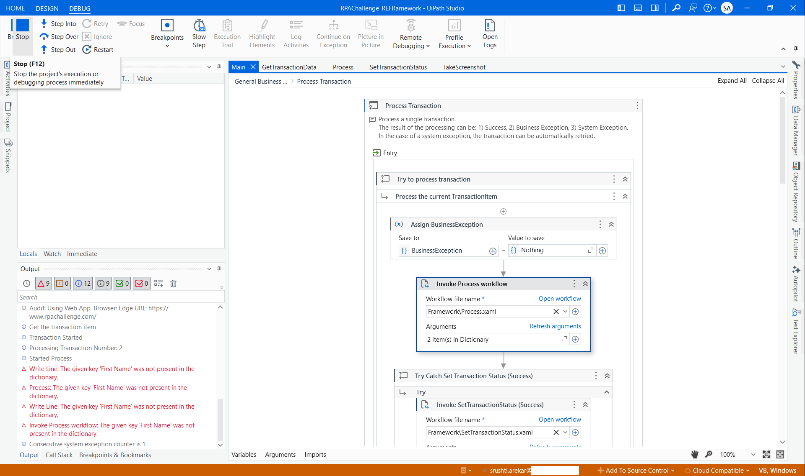
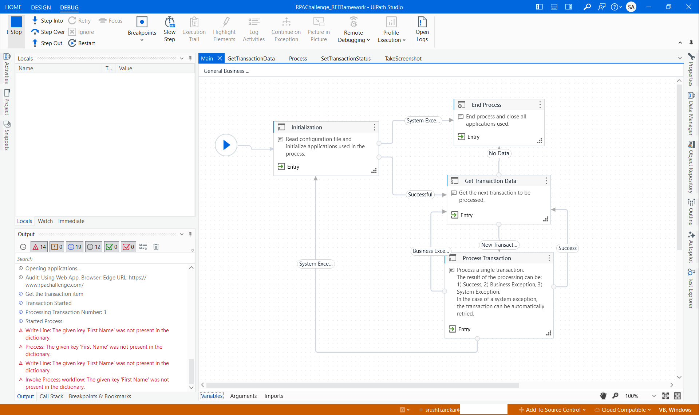
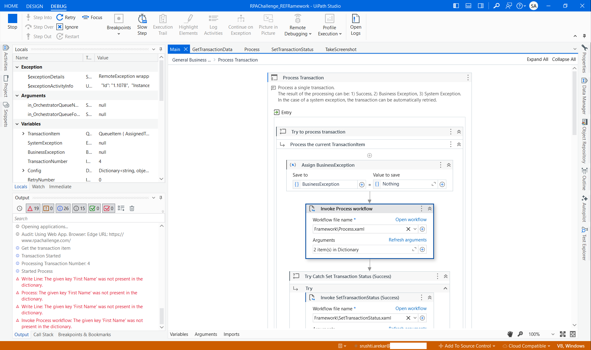
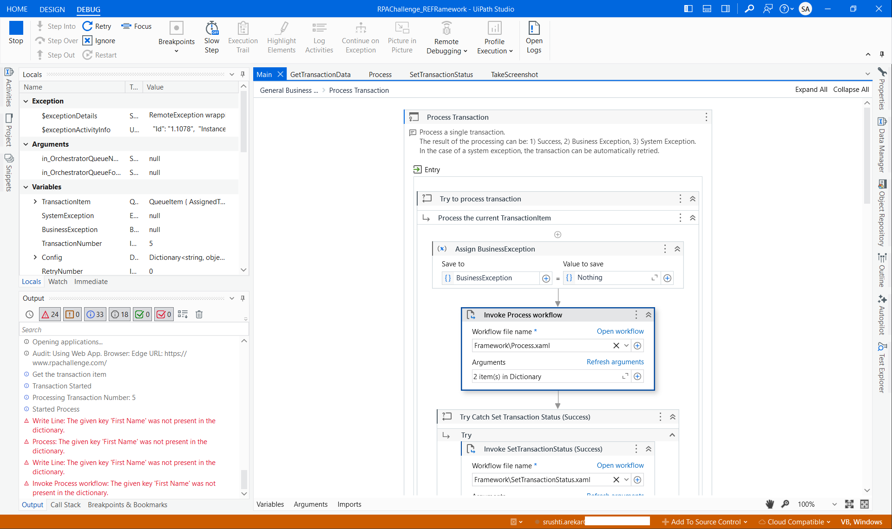
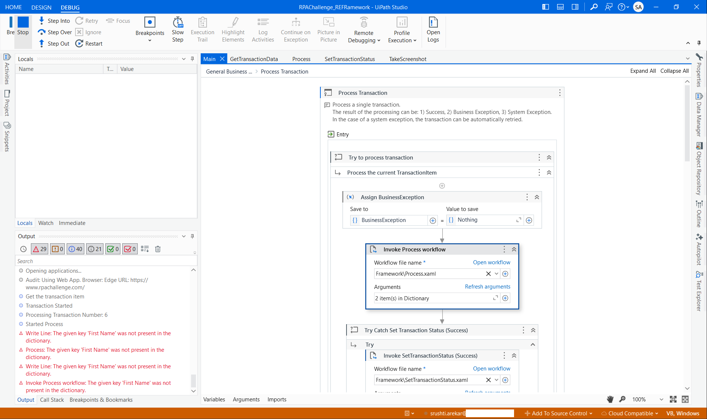
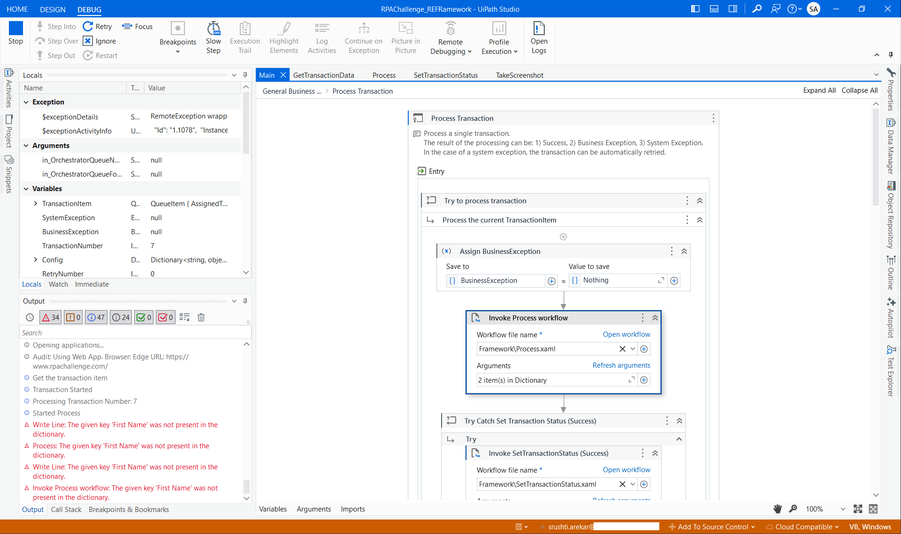

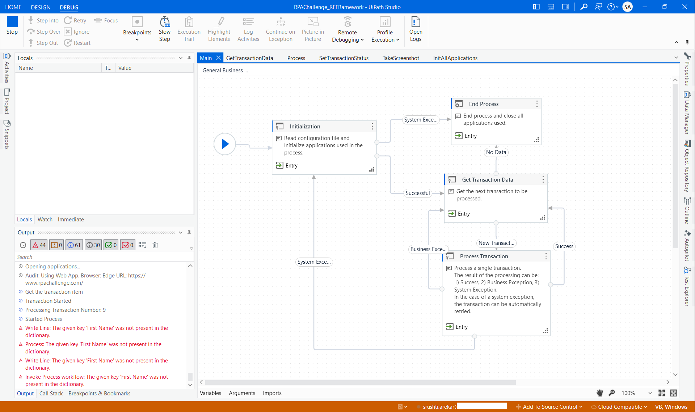
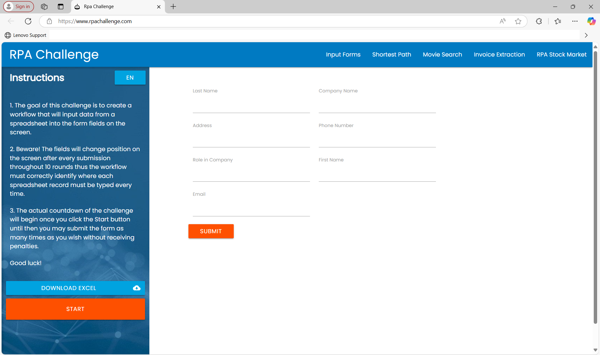
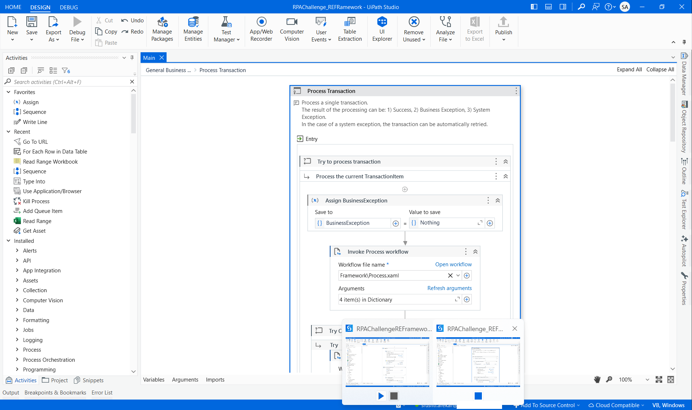
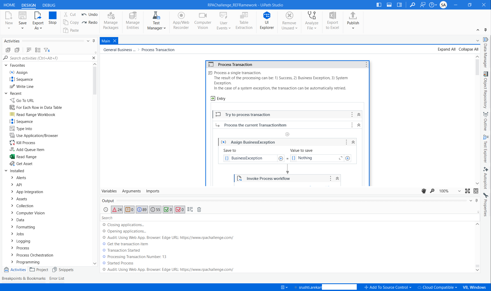
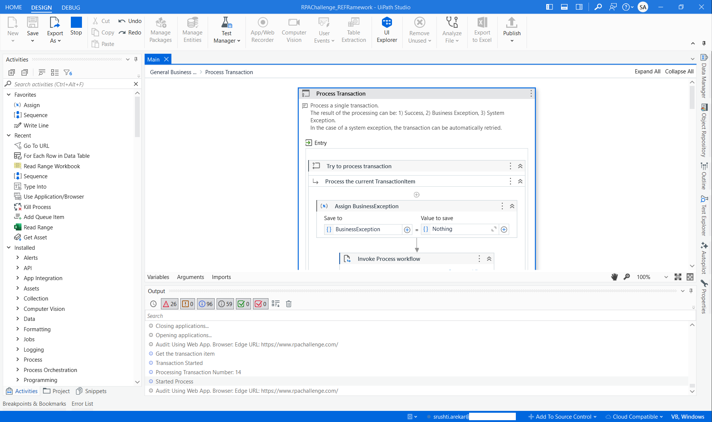
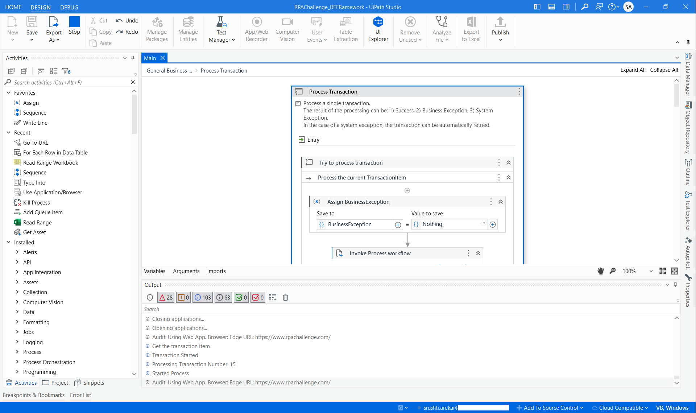
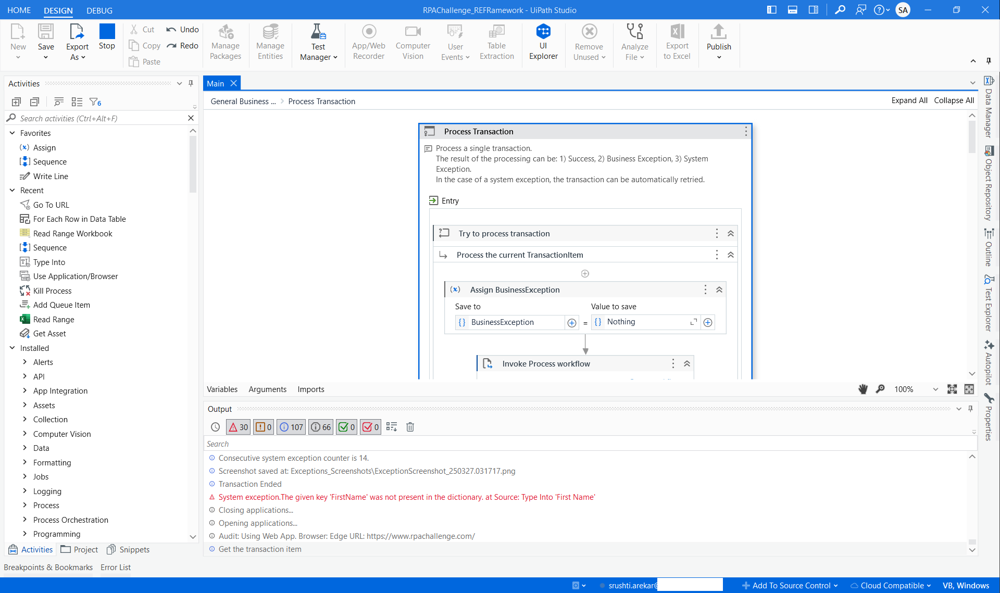
