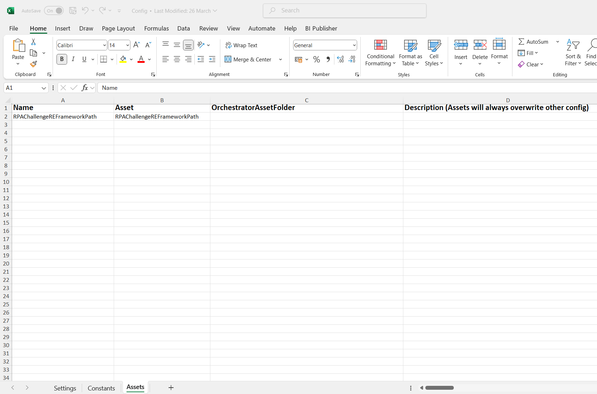

# 🤖 RPA Challenge Performer – REFramework | UiPath

This project is the **Performer** component of the **RPA Challenge** implemented using **UiPath’s REFramework**. It reads data from **Orchestrator Queues**, enters each row into the RPA Challenge web form, and handles exceptions and retry mechanisms gracefully.

---

## 🧠 REFramework — Robotic Enterprise Framework
The Robotic Enterprise Framework (REFramework) is a robust, scalable, and reusable automation framework built using UiPath’s State Machine architecture. It is ideal for transactional business processes and provides a standard template to handle initialization, transaction processing, exception handling, and application cleanup—with built-in support for Orchestrator Queues and enhanced logging.

---

## 🚀 Key Features
- ✅ Based on Transactional Business Process template
- 🧩 Implements State Machine for modular control flow
- 🔐 Securely retrieves credentials from Orchestrator Assets or Windows Credential Manager
- ⚙️ Stores dynamic settings in Config.xlsx and environment-specific assets
- 📦 Handles Orchestrator Queue items and updates their transaction statuses
- 📸 Captures screenshots for system exceptions to aid debugging
- 📑 Provides detailed logs for traceability and auditing

---

## 🔄 Workflow Phases
## 1️⃣ Initialization Phase
**Workflow	Description**
- ```InitAllSettings.xaml``` - Loads configuration data from Config.xlsx and Orchestrator assets
- ```GetAppCredential.xaml``` - Retrieves credentials from secure stores
- ```InitAllApplications.xaml``` - Launches and logs in to required applications

## 2️⃣ Transaction Retrieval
**Workflow	Description**
- ```GetTransactionData.xaml``` - Fetches transaction items from Orchestrator Queue or other sources via ```Config("OrchestratorQueueName")```

## 3️⃣ Transaction Processing
**Workflow	Description**
- ```Process.xaml``` - Main business logic — processes each transaction and invokes sub-workflows
- ```SetTransactionStatus.xaml``` - Updates the transaction status in Orchestrator (Success, Business Exception, System Exception)

## 4️⃣ Closure Phase
**Workflow	Description**
- ```CloseAllApplications.xaml``` - Logs out and gracefully closes all used applications

## 🧰 Setting Up a New REFramework Project
**Customize Config.xlsx**
Add application paths, URLs, credentials, queue names, and other constants

**Implement Application Initialization & Cleanup**
Update InitAllApplications.xaml and CloseAllApplications.xaml to suit your process

**Adapt Transaction Logic**
Modify GetTransactionData.xaml and SetTransactionStatus.xaml if you're not using Orchestrator queues

**Develop Process Logic**
Design the core automation steps inside Process.xaml
Reuse or modularize using Invoke Workflow activities

---

## 🛡️ Exception Handling & Logging

**REFramework includes:**
- Global try-catch in each state
- Retry logic for system exceptions
- Detailed logging using Log Message activities
- Automatic screenshot capture on system failure (saved in /Exceptions_Screenshots)

---

> 💡 This is the Performer part of the full REFramework solution. The Dispatcher (linked below) is responsible for uploading data to the queue.

### 🔗 Related Dispatcher Project
[RPAChallengeREFrameworkDispatcher](https://github.com/SrushtiArekar/UiPath-Portfolio/tree/main/RPAChallengeUsingREFramework/RPAChallengeREFrameworkDispatcher)

---

## 📌 Project Overview

- Uses **UiPath REFramework** with minor modifications for queue-based input
- Reads `TransactionItem` of type `QueueItem`
- Extracts SpecificContent from each queue item
- Navigates to the [RPA Challenge website](https://www.rpachallenge.com/)
- Fills out the form with all the required fields
- Submits the form and proceeds with the next item

---

## 📂 Project Contents

- `Main.xaml` – REFramework entry point
- `InitAllSettings.xaml` – Initializes config
- `GetTransactionData.xaml` – Fetches next queue item
- `Process.xaml` – Main logic to fill and submit the form
- `ExceptionHandler.xaml` – Handles errors and retries
- `Config.xlsx` – Configuration file

---

## 🖼️ Screenshots

**1. First update the Config.xlsx Excel Sheet with the Asset and Queue variables as shown below**




**2. REFramework main Workflow**


**3. Initialization - Invoke KillAllProcesses Workflow - "Kill Process" Activity - Kill the Edge process**


**4. Invoke InitAllApplications  - "Use Application/ Browser" Activity - put launching url link**
**Properties**
- Close - Never
- Output Element - Create Variable - "uieEdgeGoogleSearch" - (Later convert it to argument - set the direction - in, out, in/out ) - (later refresh the arguments and map the appropriate  variables)


**5. Invoke Process Workflow - Open Workflow**


**6. End Process - Close Edge Browser - use appropriate activity to close the application**


---

## ▶️ How to Run

1. Run the [Dispatcher](https://github.com/SrushtiArekar/UiPath-Portfolio/tree/main/RPAChallengeUsingREFramework/RPAChallengeREFrameworkDispatcher) project to upload queue items to `RPAChallengeREFrameworkQueue`.
2. In UiPath Orchestrator:
   - Ensure assets like URL, credentials (if needed), etc. are defined.
3. Open this [Performer](https://github.com/SrushtiArekar/UiPath-Portfolio/tree/main/RPAChallengeUsingREFramework/RPAChallenge_REFRamework) project in UiPath Studio.
4. Run `Main.xaml`.
5. Watch as it loops through the queue, submits the form, and logs the results.

---

## 🛠️ Built With

- UiPath Studio – Community/Enterprise Edition
- REFramework (Robotic Enterprise Framework) – Used for standardized project structure
- UiPath Orchestrator – For managing assets and queues
- Excel Activities Package – For reading tabular data
- System Activities – For dictionary and workflow control
- Orchestrator Queues – For transaction-level processing

---

## 🙋‍♀️ Author

**Srushti Arekar**  
[MyProfile](https://github.com/SrushtiArekar)

---

## 📄 License

This project is licensed under the MIT License.
