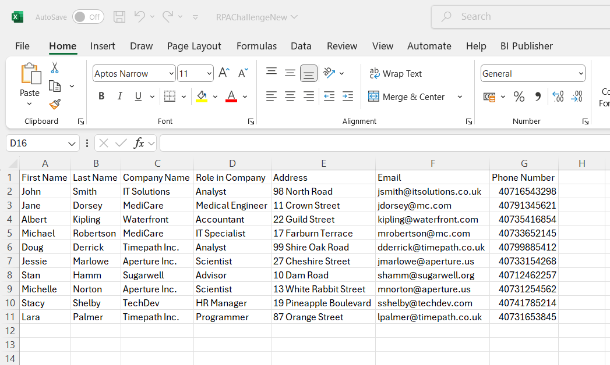
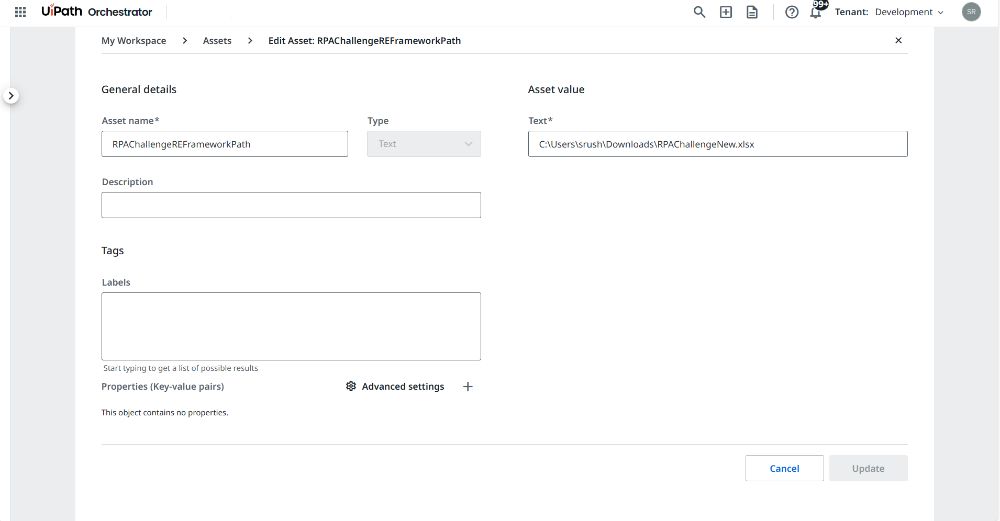
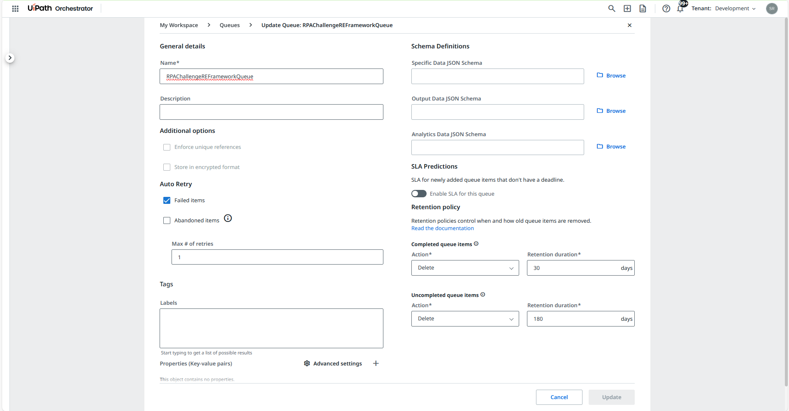

# 🤖 RPA Project_REFramework – Queue-based Data Entry with REFramework

This project is an advanced version of the [RPA Challenge](https://rpachallenge.com/) implemented using **UiPath REFramework**, **Orchestrator Queues**, and **Assets**.

---

## 🚀 What It Does

✅ Reads structured data from an Excel file  
✅ Pushes each row as a transaction item to an **Orchestrator Queue**  
✅ Uses **REFramework to process each item dynamically**  
✅ Enters data into the web form (with fields changing order)  
✅ Uses **Assets for input file path and URL**  
✅ **Logs every step using built-in logging of REFramework**  
✅ **Gracefully handles system/business exceptions**

---

## 🏗️ Project Architecture

- **Framework:** REFramework (Transactional Business Process)
- **Queues:** `RPAChallengeREFrameworkQueue`  
- **Assets:**  
  - `RPAChallengeREFrameworkPath` - `C:\Users\srush\Downloads\RPAChallengeNew.xlsx`
- **Transaction Item Type:** `QueueItem` with fields like FirstName, LastName, etc.

---

## 🛠️ Technologies Used

- UiPath Studio (REFramework)
- Orchestrator Queues & Assets
- Excel Activities
- Anchor Base Activities
- Error Handling with Try-Catch & Logging

---

## 📁 Folder Structure

RPAChallengeREFrameworkDispatcher/
- Main.xaml
- project.json
- README.md

RPAChallenge_REFRamework/
- Main.xaml
- project.json
- README.md

---

## 📸 Screenshots
1. Input

2. Asset

3. Queue

4. BotExecution

---

## ▶️ How to Run

1. Upload the Excel data to Orchestrator Queue in RPAChallengeREFrameworkDispatcher (We can also do it in Init State, but here I have used a separate dispatcher project)
2. Configure Assets: `RPAChallengeREFrameworkPath`
3. Publish to Orchestrator or run locally
4. Monitor transactions in Orchestrator

---

## 🙋‍♀️ Author

**Srushti Arekar**  
[GitHub Profile](https://github.com/SrushtiArekar)

---

## 📄 License

This project is licensed under the MIT License.
