# 📦 REFDispatcher_JDE_Assignment – Dispatcher Project

This is the **Dispatcher** component of the REFramework-based solution for automating **Journal Entry creation in JD Edwards (JDE)** using data from an Accrual Excel file. It reads the input data and pushes each row as a separate **Queue Item** to **UiPath Orchestrator**, to be processed by the Performer bot.

---

## 🎯 Purpose

This Dispatcher prepares transaction data and pushes each row to Orchestrator by:

- Fetching the input Excel path from an **Orchestrator Asset**
- Reading all records into a `DataTable`
- Looping through each row and mapping values inline to key-value pairs
- Adding each record as a **Queue Item** into `REFramework_JDE_Queue`

---

## 🔄 Workflow Overview

1. **Get Asset**  
   - Reads the asset `REFrameworkJDEAssignment` from Orchestrator, which holds the full path of the Accrual Excel file.

2. **Read Excel File**  
   - Loads the data from the specified Excel sheet into a `DataTable` named `dt_JDEData`.

3. **Loop Through Each Row**  
   - Iterates using:
     ```vb
     For Each CurrentRow In dt_JDEData.Rows
     ```
   - Inline mapping in `Add Queue Item`:
     ```vb
     SpecificContent → Collection:
      {
        {"AccountNumber", CurrentRow.Item("Account Number").ToString},
        {"Amount", CurrentRow.Item("Amount").ToString},
        {"Sub", CurrentRow.Item("SUB").ToString},
        {"SubType", CurrentRow.Item("SUB TYPE").ToString},
        {"Remark", CurrentRow.Item("REMARK").ToString},
        {"Description", CurrentRow.Item("DESCRIPTION").ToString}
      }
     ```
   - Each row is added as a **Queue Item** in `REFramework_JDE_Queue`.

---

## 🧠 Queue Configuration

- **Queue Name:** `REFramework_JDE_Queue`
- **Queue Type:** Classic Queue in Orchestrator
- **Transaction Item Content Example:**

```vb {
  "AccountNumber": "1.1110.AUTOCSP",
  "Amount": "89.00",
  "Sub": "2AD",
  "SubType": "S",
  "Remark": "Test 8",
  "Description": "AP ACCRUAL -2"
}
```


## 📸 Screenshots

1. Get the Asset
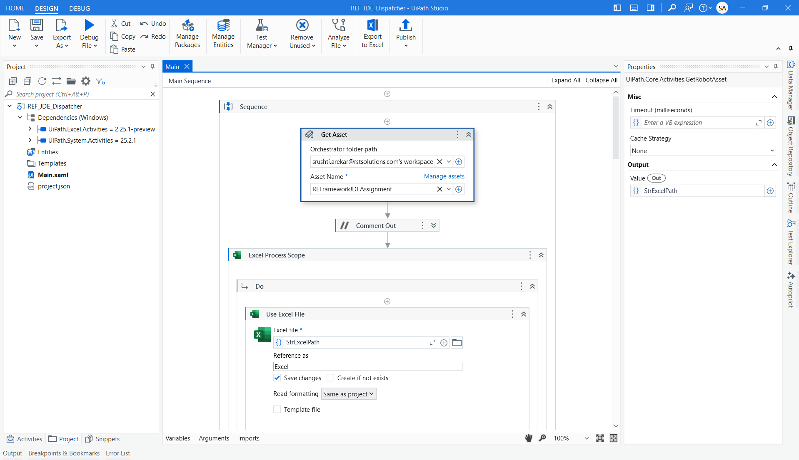

2. Read the Excel File
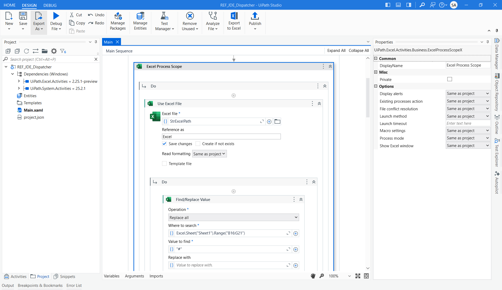
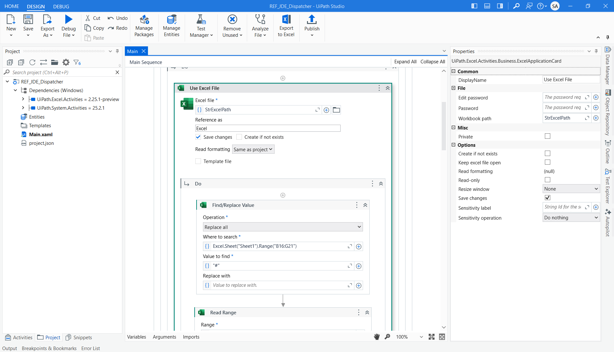
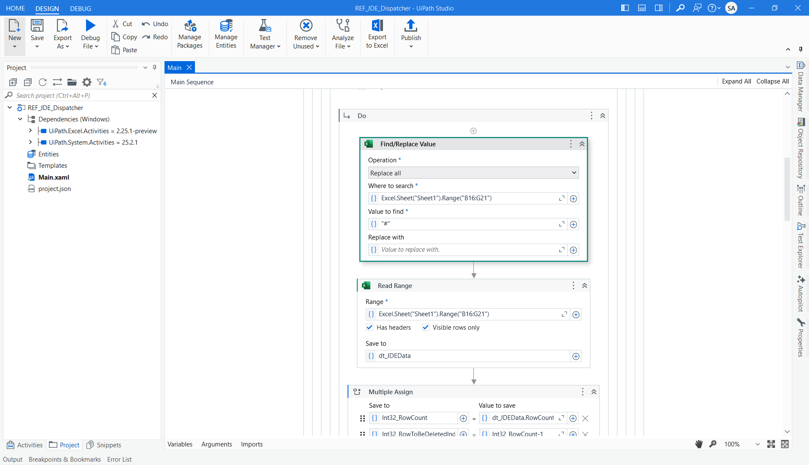

3. Read Range - and store it into the Data Table dt_JDEData
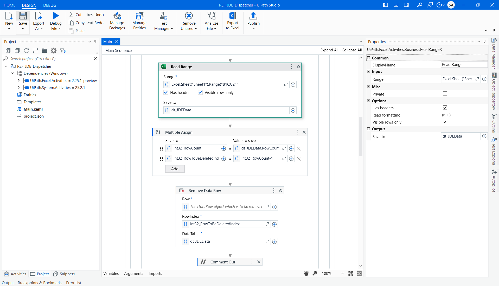

4. Delete the last row from the Data Table
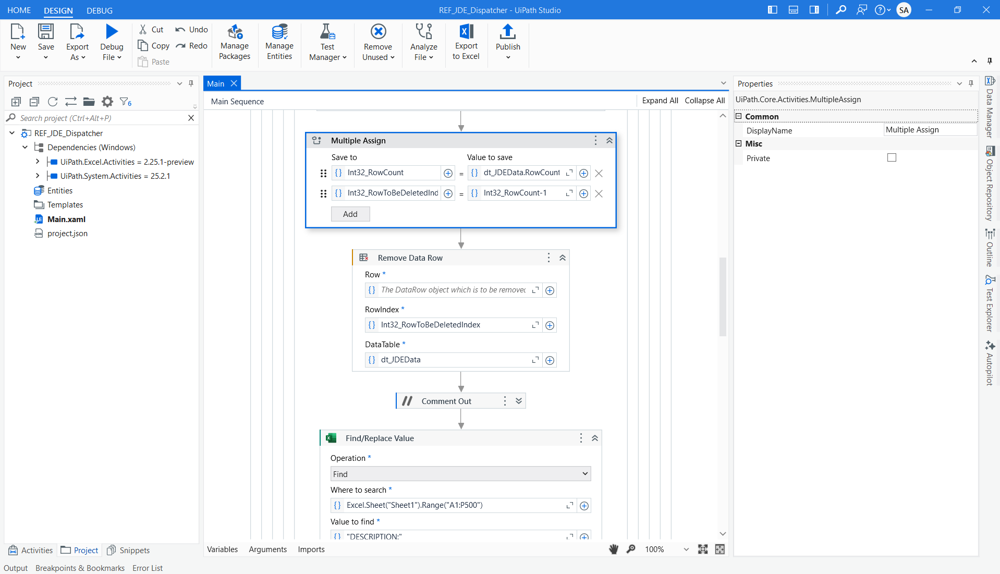
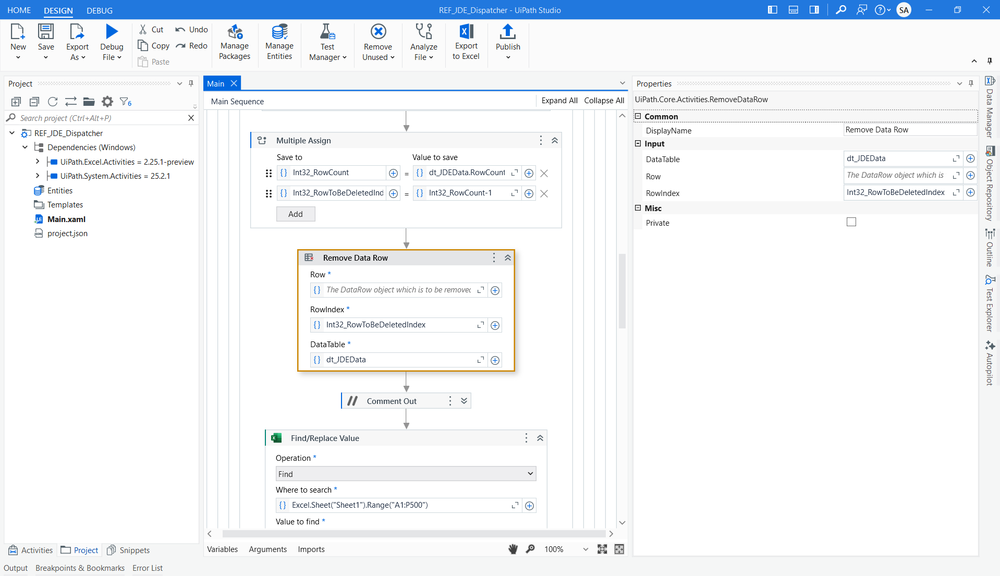

5. Find the Description in the Excel sheet and add new column to the Data table and add the description value in every row

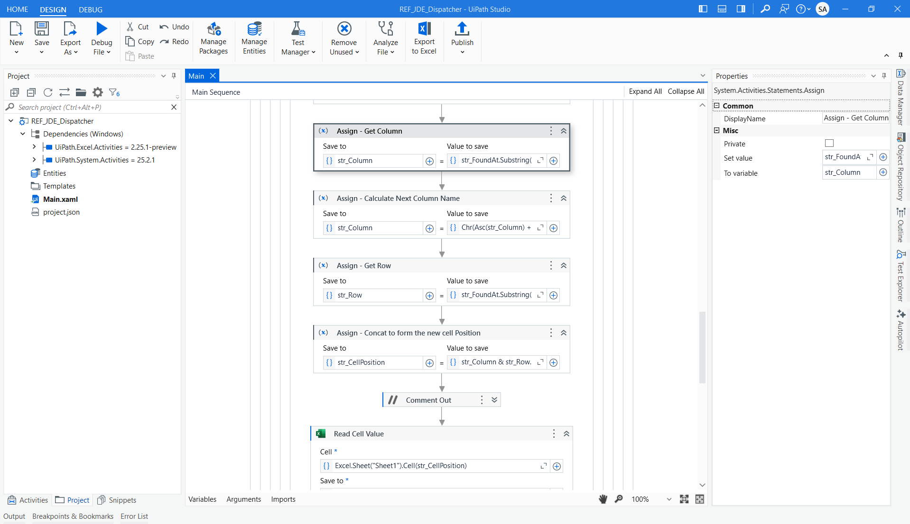
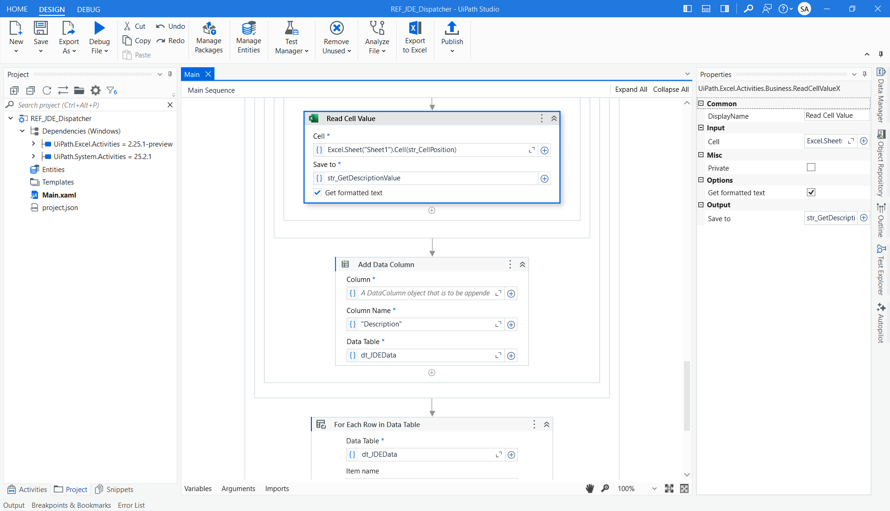
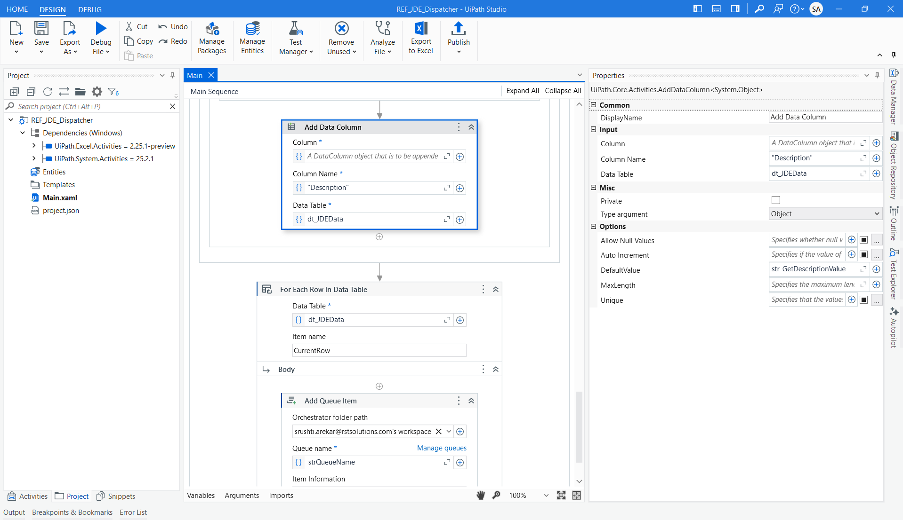

6. Foreach Row in the Data Table -  Add Queue Item - Map the parameters
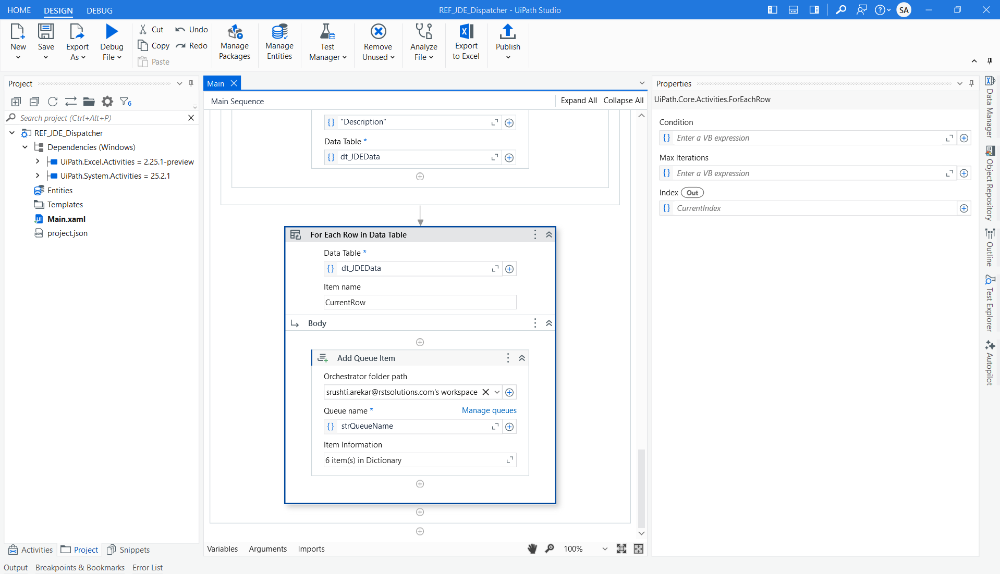
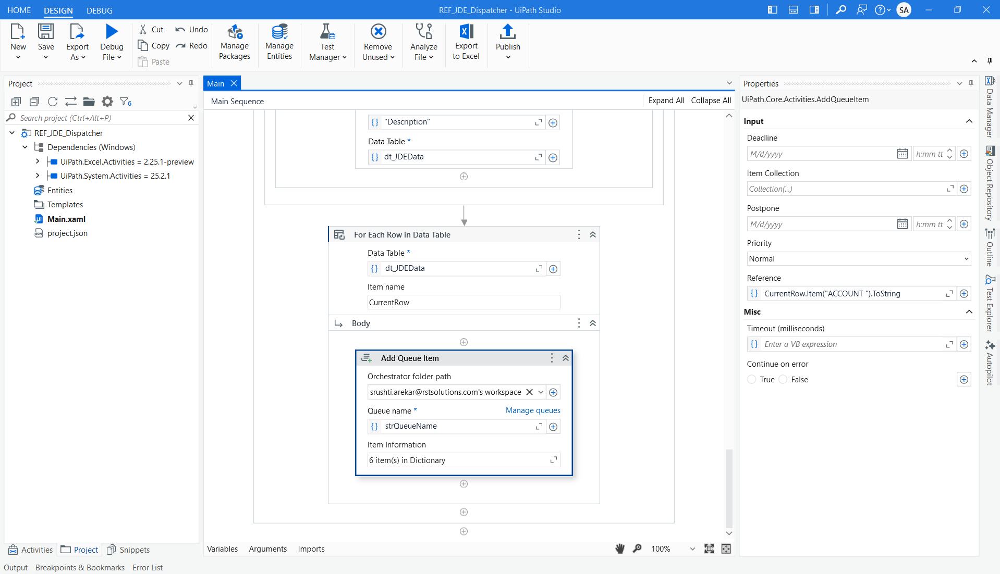
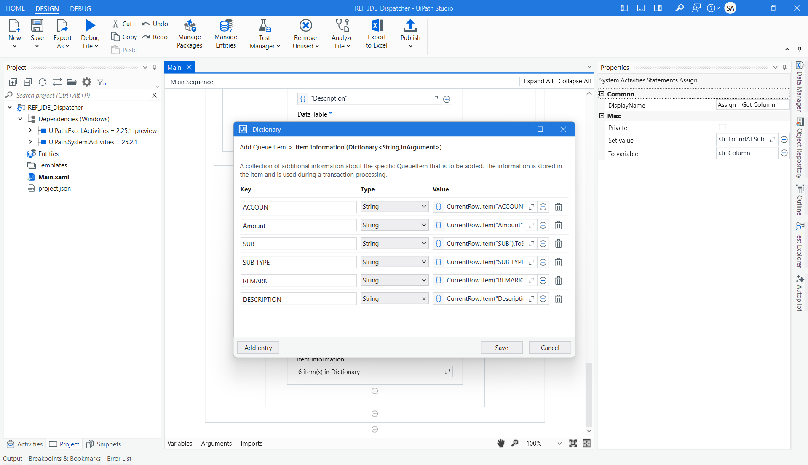
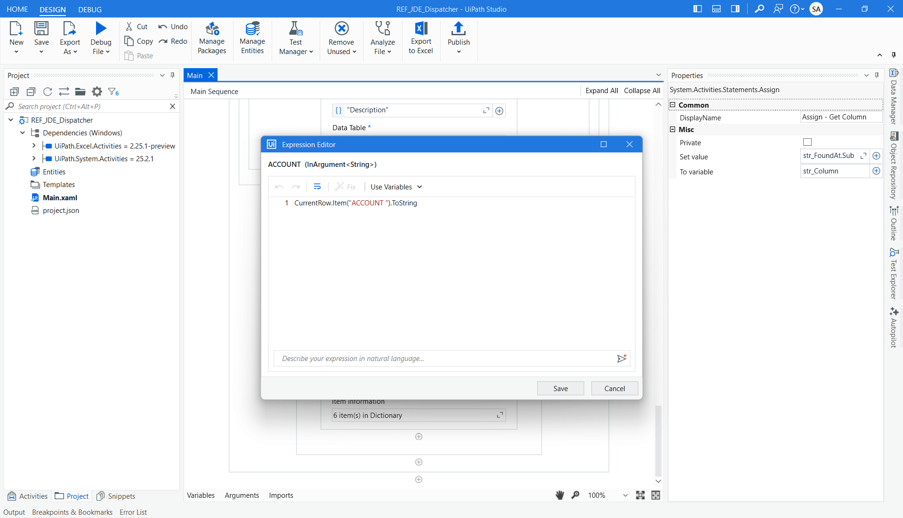

7. After Execution - successfully added the data from the Excel to Queue
When we View the Transactions in Queue
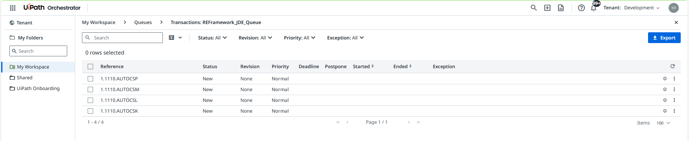
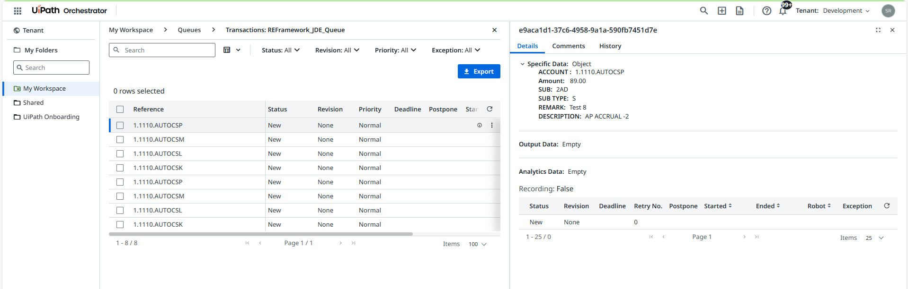

---

▶️ **How to Run**

**1. Clone the Repository**
Clone this repository or download the ZIP.

**2. Open the Project in UiPath Studio**
Open REFDispatcher_JDE_Assignment in UiPath Studio.

**3. Create Orchestrator Assets and Queues**

**4. Configure the Config.xlsx** - file with the details of Assets and Queues

**5. Run the Dispatcher**
- Run the Main.xaml file

```

🛠️ **Built With**
- UiPath Studio – Community/Enterprise Edition
- REFramework (Robotic Enterprise Framework) – Used for standardized project structure
- UiPath Orchestrator – For managing assets and queues
- Excel Activities Package – For reading tabular data
- System Activities – For dictionary and workflow control
- Orchestrator Queues – For transaction-level processing
- 

## 🙋‍♀️ Author

**Srushti Arekar**  
[MyProfile](https://github.com/SrushtiArekar)

---

## 📄 License

This project is licensed under the MIT License.

