# 🤖 JDE Accrual Journal Entry Performer – REFramework | UiPath

This project is the **Performer component** of the **JDE Accrual Journal Entry** automation built using **UiPath’s REFramework**. It retrieves transaction data from **Orchestrator Queues**, processes each line in **JD Edwards EnterpriseOne**, generates a final report, and sends it to stakeholders via email.

---

## 🧠 REFramework — Robotic Enterprise Framework
The Robotic Enterprise Framework (REFramework) is a scalable and robust automation architecture based on a state machine. It efficiently handles transactional processes, integrates logging, supports retry logic, manages Orchestrator queues, and gracefully handles exceptions.

---

## 🚀 Key Features
-  Built entirely on REFramework with best practices
-  Processes Accrual Journal Entries in JD Edwards
-  Retrieves transaction data from Orchestrator Queue
-  Populates Accrual Excel file with Batch Number & metadata
-  Generates and downloads the General Journal Batch Report
-  Merges PDFs and sends email with final report
-  Uses Config.xlsx and Assets for dynamic settings
-  Robust exception and retry mechanism for resilience

---

## 🔄 Workflow Phases

## 1️⃣ Initialization Phase
**Workflow	Description**
- ```InitAllSettings.xaml``` - Loads configuration data from Config.xlsx and Orchestrator assets
- ```GetAppCredential.xaml``` - Retrieves credentials from secure stores
- ```InitAllApplications.xaml``` - Launches and logs in to required applications

## 2️⃣ Transaction Retrieval
**Workflow	Description**
- GetTransactionData.xaml – Fetches items from Orchestrator Queue `REFramework_JDE_Queue`

## 3️⃣ Transaction Processing
**Workflow	Description**
- ```Process.xaml``` - Core business logic including:
- **Navigate JDE menu**
- Enter **Journal data line-by-line** (Account, Amount, Sub, SubType, Remark, Description)
- Submit **entry** and capture **Batch Number**
- Update **Excel with Batch info**
- Convert **updated Excel to PDF**
- **Run and download Batch Report**
- **Send report via Outlook email** to stakeholders

## 4️⃣ Closure Phase
**Workflow	Description**
- ```CloseAllApplications.xaml``` - Logs out and gracefully closes all used applications

## 🛠️ Transaction Queue Item Format

**Queue Name:** REFramework_JDE_Queue
**SpecificContent Example:**
```vb
{
  "AccountNumber": "1.1110.AUTOCSP",
  "Amount": "89.00",
  "Sub": "2AD",
  "SubType": "S",
  "Remark": "Test 8",
  "Description": "AP ACCRUAL -2",
  "PreparedBy": "Jane Doe"
}
```

## ▶️ How to Run
- Run the Dispatcher to upload Excel rows to JDEAccrualQueue
- Open this Performer project in UiPath Studio
- Ensure required Assets and Queue are available in Orchestrator
- Run Main.xaml
- Bot will process each queue item, generate and email reports

## 📁 Project Structure
- `Main.xaml` – Entry point for REFramework
- `InitAllSettings.xaml` – Loads config
- `InitAllApplications.xaml` – Launches JDE and logs in
- `Process.xaml` – Handles journal entry, reporting, and email
- `KillAllProcesses.xaml` – Ends background processes
- `CloseAllApplications.xaml` – Final cleanup
- `Config.xlsx` – Dynamic values for paths, URLs, etc.

---

## 📈 Screenshots


---

## 🛡️ Exception Handling & Logging

**REFramework includes:**
- Global try-catch in each state
- Retry logic for system exceptions
- Detailed logging using Log Message activities
- Automatic screenshot capture on system failure (saved in /Exceptions_Screenshots)

---

> 💡 This is the Performer part of the full REFramework solution. The Dispatcher (linked below) is responsible for uploading data to the queue.

### 🔗 Related Dispatcher Project
[REFDispatcher_JDE_Assignment](https://github.com/SrushtiArekar/RPA_UiPath/tree/main/RPA_JDEdwards_REFramework/REFDispatcher_JDE_Assignment)

---

## 📌 Project Overview

- Uses **UiPath REFramework** with minor modifications for queue-based input
- Reads `TransactionItem` of type `QueueItem`
- Extracts SpecificContent from each queue item
- Navigates to the [RPA Challenge website](https://www.rpachallenge.com/)
- Fills out the form with all the required fields
- Submits the form and proceeds with the next item

---

## 📂 Project Contents

- `Main.xaml` – REFramework entry point
- `InitAllSettings.xaml` – Initializes config
- `GetTransactionData.xaml` – Fetches next queue item
- `Process.xaml` – Main logic to fill and submit the form
- `ExceptionHandler.xaml` – Handles errors and retries
- `Config.xlsx` – Configuration file

---

## 🖼️ Screenshots

**1. First update the Config.xlsx Excel Sheet with the Asset and Queue variables as shown below**
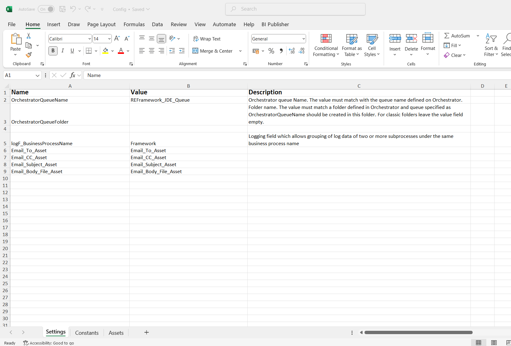
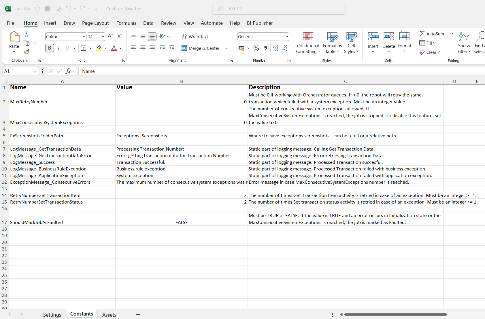
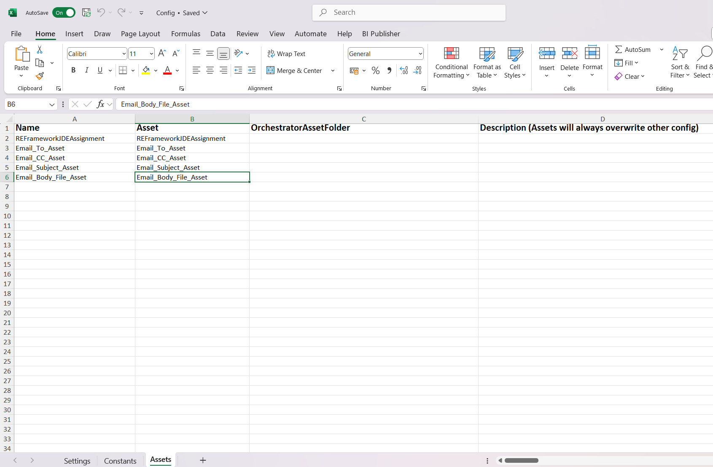

**2. REFramework main Workflow**
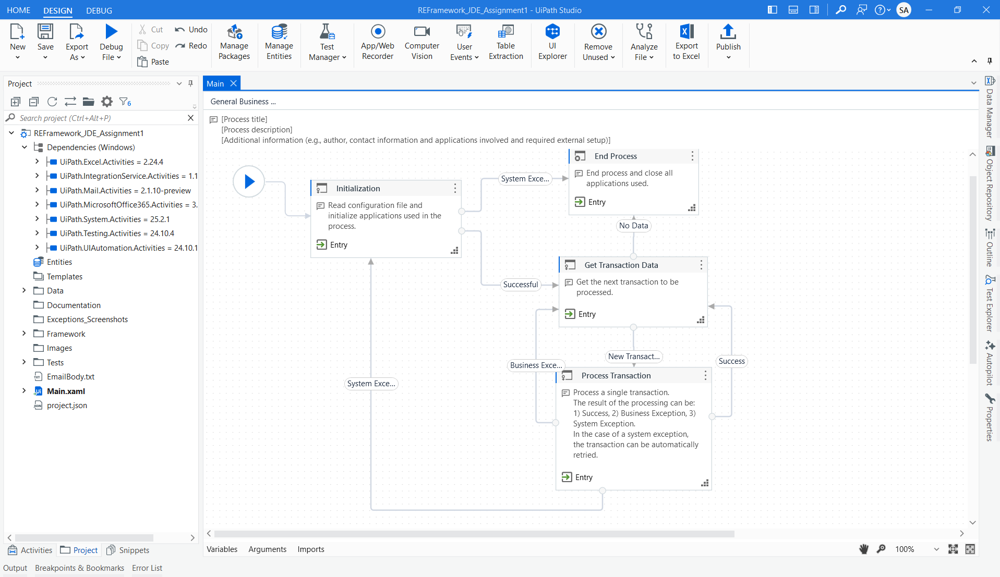

**3. Initialization - Invoke KillAllProcesses Workflow - "Kill Process" Activity - Kill the Edge process**


**4. Invoke InitAllApplications  - "Use Application/ Browser" Activity - put launching url link**
**Properties**
- Close - Never
- Output Element - Create Variable - "uieEdgeGoogleSearch" - (Later convert it to argument - set the direction - in, out, in/out ) - (later refresh the arguments and map the appropriate  variables)
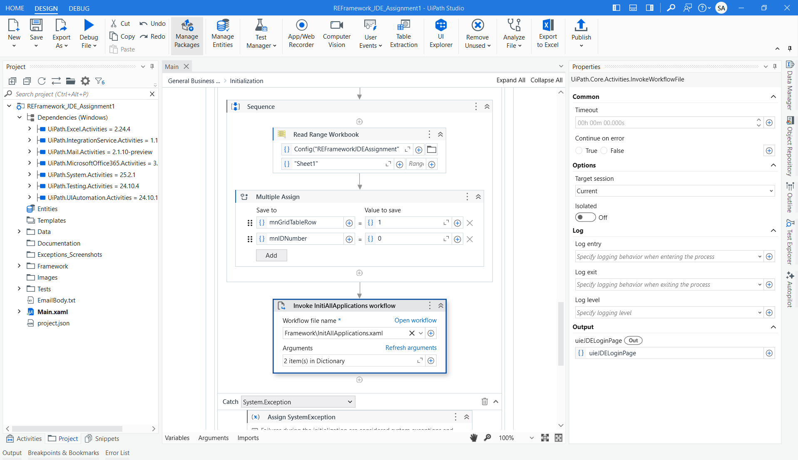
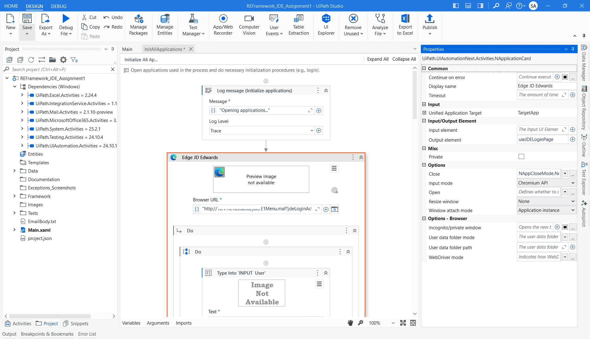

**5. Invoke Process Workflow - Open Workflow**
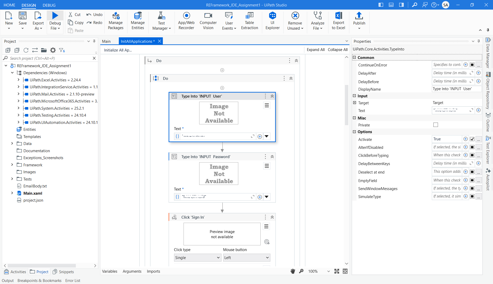
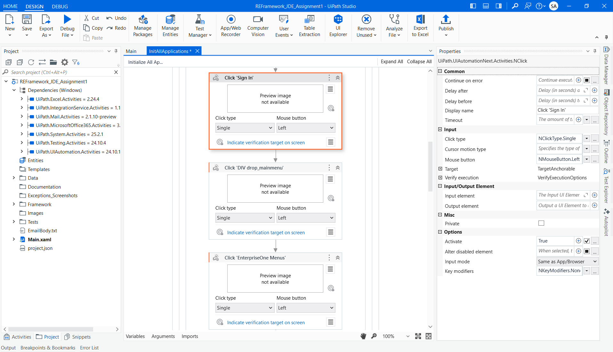


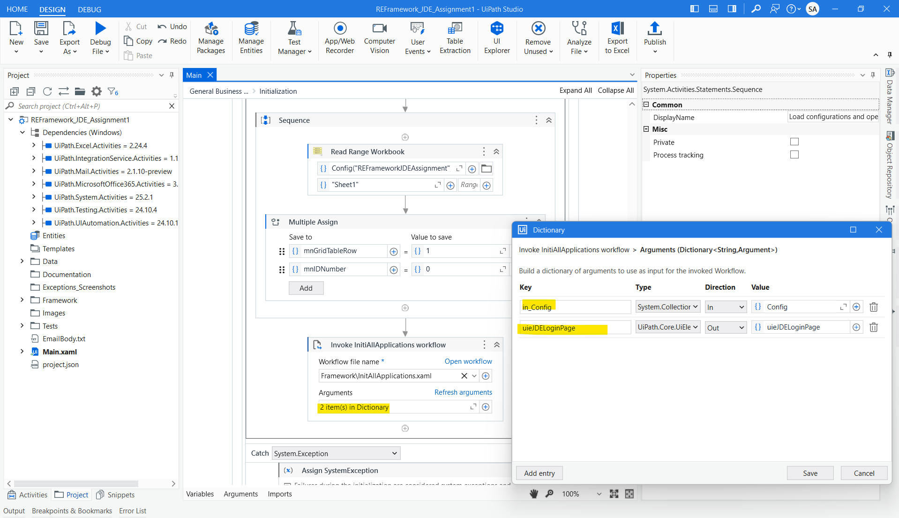

**6. End Process - Close Edge Browser - use appropriate activity to close the application**
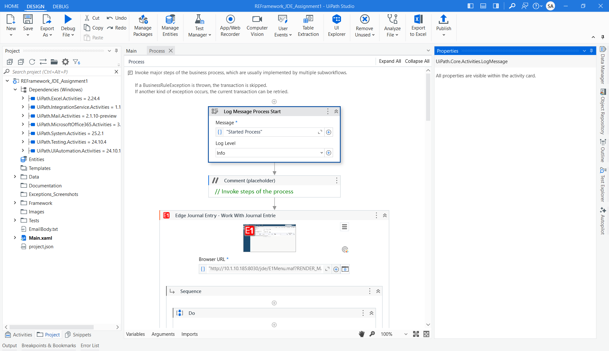
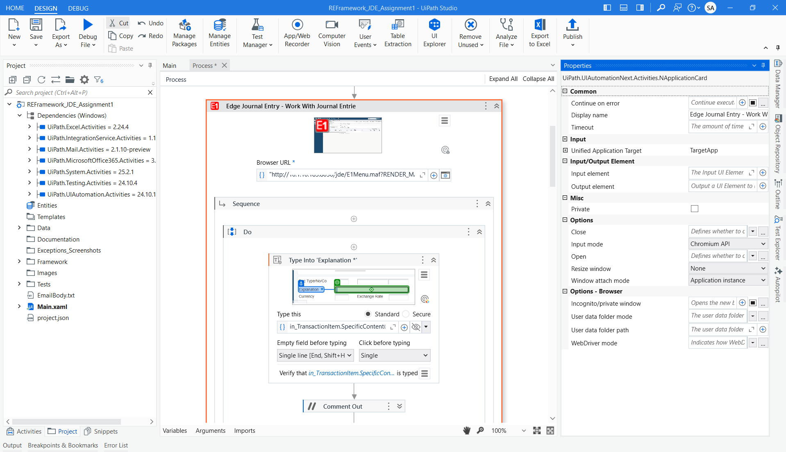

---

## ▶️ How to Run

1. Run the [Dispatcher](https://github.com/SrushtiArekar/RPA_UiPath/tree/main/RPA_JDEdwards_REFramework/REFDispatcher_JDE_Assignment) project to upload queue items to `REFDispatcher_JDE_Assignment`.
2. In UiPath Orchestrator:
   - Ensure assets like URL, credentials (if needed), etc. are defined.
3. Open this [Performer](https://github.com/SrushtiArekar/RPA_UiPath/tree/main/RPA_JDEdwards_REFramework/REFramework_JDE_Assignment1) project in UiPath Studio.
4. Run `Main.xaml`.
5. Watch as it loops through the queue, submits the form, and logs the results.

---

## 🛠️ Built With

- **UiPath Studio** – Community/Enterprise Edition
- **REFramework (Robotic Enterprise Framework)** – Used for standardized project structure
- **UiPath Orchestrator** – For managing assets and queues
- **Excel Activities Package** – For reading tabular data
- **System Activities** – For dictionary and workflow control
- **Orchestrator Queues** – For transaction-level processing

---

## 🙋‍♀️ Author

**Srushti Arekar**  
[MyProfile](https://github.com/SrushtiArekar)

---

## 📄 License

This project is licensed under the MIT License.

