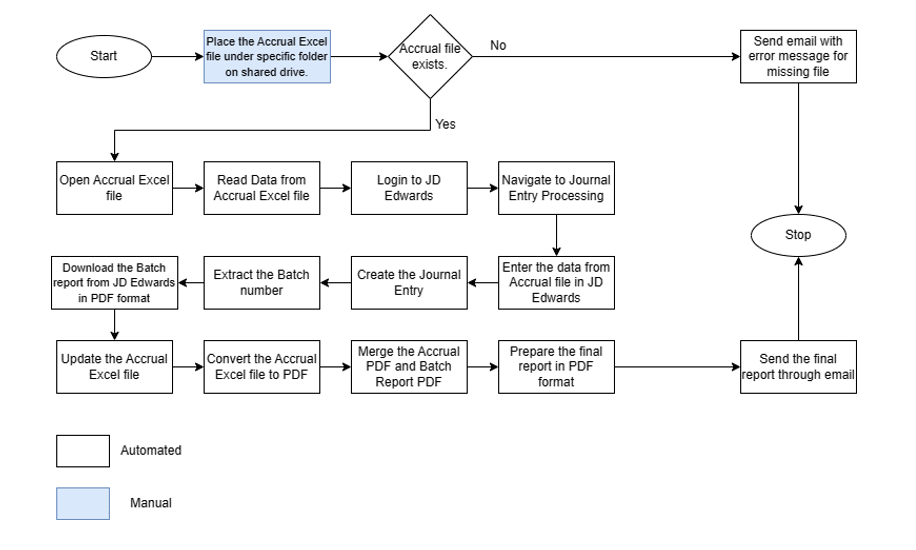
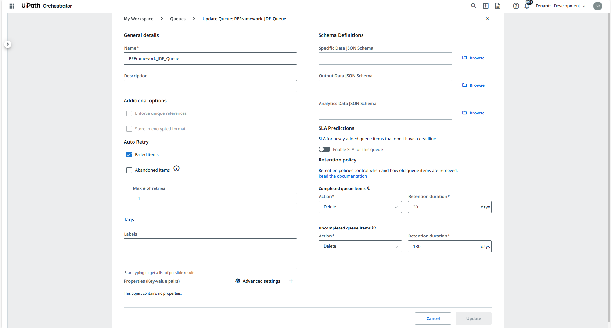

# 🤖 RPA Project_REFramework – Journal Entry Processing in JD Edwards using RPA REFramework

This project automation project uses the **Robotic Enterprise Framework (REFramework)** to automate the process of **creating Journal Entries** in **JD Edwards EnterpriseOne (ERP System)**.

---

## 🚀 What It Does

This process will read the data from Accrual excel file and create Journal entry in JD Edwards system. The Journal entry is created, and the batch number is extracted from JD Edwards. The batch number is populated in Accrual excel file along with the information such as Prepared By and the date of preparation. The Accrual excel file is converted to PDF format. The Batch report is then downloaded from JD Edwards system in PDF format. The PDF format of Accrual file and the batch report are merged to prepare a final report. The final report is then sent to stakeholders through email.

✅ Reads data from an CSV Report file  
✅ Uses **Assets for input file path and URL**  
✅ Pushes each row as a transaction item to an **Orchestrator Queue**  
✅ Uses **REFramework to process each item dynamically**  
✅ Traverse through the JD Edwards EnterpriseOne **Menu** to open the desired Application for entering the **Journal entries** 
✅ Adding the data into the grid **line by line** and followed by the steps required by process for Journal Entry.
✅ Once all the data is added into the Grid in the application we have to **submit the Data** and then **Extact the Batch Number generated**.
✅ Then run a Report named - **General Jounal by Batch Report** and pass the Batch number generated in the previous step.
✅ The executed report is downloaded in **PDF format** and the final report will be **sent to stakeholders through email**.
✅ **Gracefully handles system/business exceptions**

---

## 🏗️ Project Architecture

- **Framework:** REFramework (Transactional Business Process)
- **Queues:** `RPAChallengeREFrameworkQueue`  
- **Assets:**  
  - `RPAChallengeREFrameworkPath` - `C:\Users\srush\Downloads\RPAChallengeNew.xlsx`
- **Transaction Item Type:** `QueueItem` with fields like FirstName, LastName, etc.

---

## 🛠️ Technologies Used

- UiPath Studio (REFramework)
- Orchestrator Queues & Assets
- Excel Activities
- Anchor Base Activities
- Error Handling with Try-Catch & Logging

---

## 📁 Folder Structure

RPAChallengeREFrameworkDispatcher/
- Main.xaml
- project.json
- README.md

RPAChallenge_REFRamework/
- Main.xaml
- project.json
- README.md

---

## 📸 Screenshots
1. Input

2. Asset

3. Queue

4. BotExecution

---

## ▶️ How to Run

1. Upload the Excel data to Orchestrator Queue in RPAChallengeREFrameworkDispatcher 
2. Configure Assets: `RPAChallengeREFrameworkPath`
3. Publish to Orchestrator or run locally
4. Monitor transactions in Orchestrator

---

## 🙋‍♀️ Author

**Srushti Arekar**  
[MyProfile](https://github.com/SrushtiArekar)

---

## 📄 License

This project is licensed under the MIT License.

