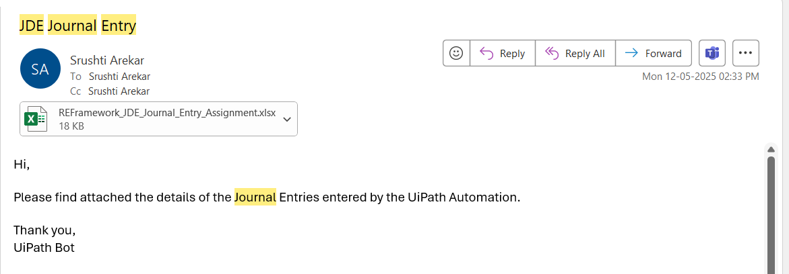

# 🤖 RPA Project_REFramework – Automation using REFramework to do the Journal Entries in JD Edwards

This project automation project uses the **Robotic Enterprise Framework (REFramework)** to automate the process of **creating Journal Entries** in **JD Edwards EnterpriseOne (ERP System)**.

---

## 🚀 What It Does

✅ Reads data from an CSV Report file  
✅ Uses **Assets for input file path and URL**  
✅ Pushes each row as a transaction item to an **Orchestrator Queue**  
✅ Uses **REFramework to process each item dynamically**  
✅ Traverse through the JD Edwards EnterpriseOne **Menu** to open the desired Application for entering the **Journal entries** 
✅ Adding the data into the grid **line by line** and followed by the steps required by process for Journal Entry.
✅ Once all the data is added into the Grid in the application we have to **submit the Data** and then **Extact the Batch Number generated**.
✅ Then run a Report named - **General Jounal by Batch Report** and pass the Batch number generated in the previous step.
✅ **Gracefully handles system/business exceptions**

---

## 🏗️ Project Architecture

- **Framework:** REFramework (Transactional Business Process)
- **Queues:** `RPAChallengeREFrameworkQueue`  
- **Assets:**  
  - `RPAChallengeREFrameworkPath` - `C:\Users\srush\Downloads\RPAChallengeNew.xlsx`
- **Transaction Item Type:** `QueueItem` with fields like FirstName, LastName, etc.

---

## 🛠️ Technologies Used

- UiPath Studio (REFramework)
- Orchestrator Queues & Assets
- Excel Activities
- Anchor Base Activities
- Error Handling with Try-Catch & Logging

---

## 📁 Folder Structure

RPAChallengeREFrameworkDispatcher/
- Main.xaml
- project.json
- README.md

RPAChallenge_REFRamework/
- Main.xaml
- project.json
- README.md

---

## 📸 Screenshots
1. Input

2. Asset

3. Queue

4. BotExecution

---

## ▶️ How to Run

1. Upload the Excel data to Orchestrator Queue in RPAChallengeREFrameworkDispatcher 
2. Configure Assets: `RPAChallengeREFrameworkPath`
3. Publish to Orchestrator or run locally
4. Monitor transactions in Orchestrator

---

## 🙋‍♀️ Author

**Srushti Arekar**  
[MyProfile](https://github.com/SrushtiArekar)

---

## 📄 License

This project is licensed under the MIT License.

